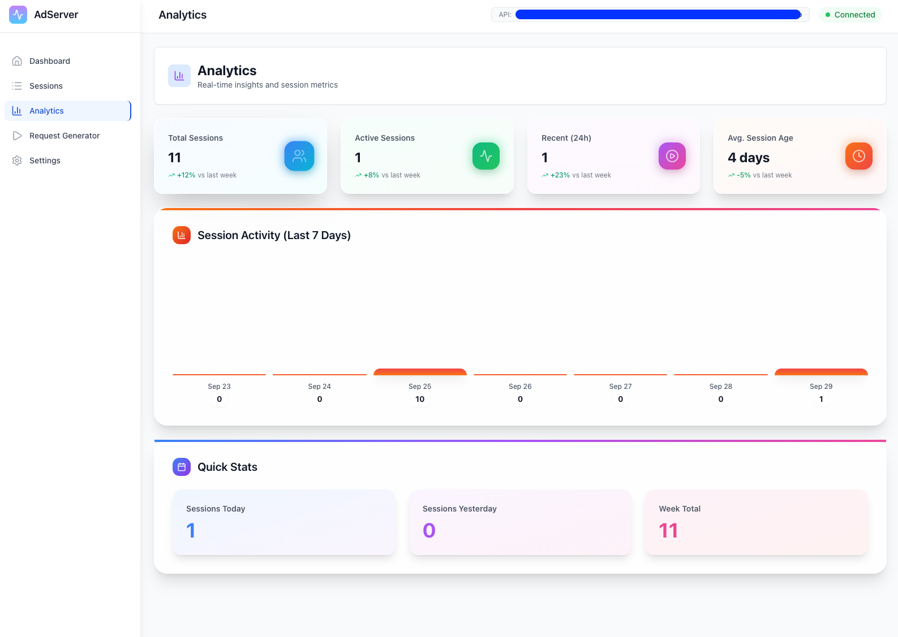

# Test Ad Server Frontend

A modern React frontend for the [Eyevinn Test AdServer](https://github.com/Eyevinn/test-adserver), providing a web interface to manage sessions, generate VAST/VMAP responses, and analyze ad serving activity.

<a href="docs/analytics.png"></a>

## Features

### 🎯 Session Management

- **Session List**: View all active sessions with creation timestamps
- **Session Details**: Detailed view of individual sessions with real-time event tracking
- **Session Deletion**: Remove unused sessions
- **Real-time Updates**: Auto-refreshing session events every 5 seconds

### 🎬 VAST/VMAP Generator

- **VAST Generation**: Create VAST 1.0-4.0 responses with configurable parameters
- **VMAP Generation**: Create VMAP responses with pre-roll, mid-roll, and post-roll configuration
- **XML Preview**: View generated XML with syntax highlighting
- **Export Options**: Copy to clipboard or download as XML files
- **Session Tracking**: Each generated ad creates a tracked session

### 📊 Analytics Dashboard

- **Session Statistics**: Total, active, and recent session counts
- **Activity Charts**: 7-day session activity visualization
- **Session Metrics**: Average session age and activity trends
- **Real-time Monitoring**: Live session status indicators

## Getting Started

### Prerequisites

- Node.js 20.19+ (recommended)
- npm or yarn
- Running Eyevinn Test AdServer instance

### Installation

1. **Clone and install dependencies:**

```bash
git clone https://github.com/your-username/adserver-frontend.git
cd adserver-frontend
npm install
```

2. **Configure API endpoint:**

```bash
cp .env.example .env
# The example configuration points to the Eyevinn Lab instance by default
# Edit .env if you want to use a different AdServer instance
```

3. **Start development server:**

```bash
npm run dev
```

4. **Open your browser:**
   Navigate to `http://localhost:5173`

### Production Build

```bash
npm run build
npm run preview
```

### Static Hosting

Build the project and upload the `dist/` folder to any static hosting service:

```bash
npm run build
# Upload dist/ folder to Netlify, Vercel, S3, etc.
```

## Contributing

1. Fork the repository
2. Create a feature branch
3. Make your changes
4. Add tests if applicable
5. Submit a pull request

## License

This project is licensed under the MIT License.

## Support

- 📚 [Eyevinn Test AdServer Documentation](https://github.com/Eyevinn/test-adserver)
- 🐛 [Report Issues](https://github.com/your-username/adserver-frontend/issues)
- 💬 [Discussions](https://github.com/your-username/adserver-frontend/discussions)

## Related Projects

- [Eyevinn Test AdServer](https://github.com/Eyevinn/test-adserver) - The backend API
- [Test AdServer Example](https://github.com/Eyevinn/test-adserver-example) - Usage examples
- [Eyevinn Open Source](https://github.com/Eyevinn) - More tools from Eyevinn Technology
